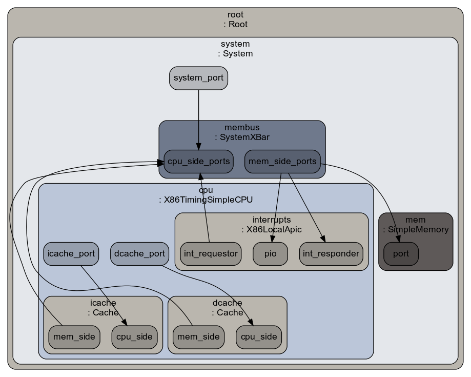

# gem5 Cache Replacement Policy Study
## Introduction

**The project implements an adaptive cache replacement policy in gem5 using the Dueling Set technique to dynamically choose between LRU and LIP policies based on runtime workload characteristics.** The system intelligently monitors cache performance through partitioned sets and a PSEL (policy selector) counter, enabling optimal policy selection for different access patterns including high-locality workloads, streaming applications, and phase-changing behaviors without prior knowledge of the workload type.

**By creating a self-tuning cache controller, this research demonstrates how adaptive policies can outperform static approaches like pure LRU or LIP, providing better overall miss rates and IPC across diverse applications—a crucial advancement for modern processors that encounter varying memory access patterns in real-world usage scenarios.**
## What is gem5?

**Gem5 emerged in 2011 from the merger of two pioneering academic simulators—Michigan's m5 (focusing on CPU modeling) and Wisconsin's GEMS (specializing in memory systems)—creating a unified, modular platform for full-system computer architecture research.** This fusion established gem5 as the dominant open-source simulator in both academia and industry, evolving through versions that added support for diverse ISAs (ARM, x86, RISC-V), GPU modeling, and system-level features while maintaining its core philosophy of separating functional simulation from timing models.

**Today, gem5 serves as a virtual hardware laboratory where researchers explore CPU microarchitectures, cache hierarchies, memory controllers, and interconnects without physical fabrication.** Its primary use cases include prototyping new processor designs (like Apple's early ARM experiments), evaluating cache replacement policies (as in your streaming workload experiments), studying side-channel vulnerabilities like Spectre/Meltdown, validating memory consistency models, and serving as a reference model for commercial RTL development by companies like ARM, Google, and AMD.

## How gem5 Works Generaly
**Gem5 is a modular, cycle-accurate computer architecture simulator that enables researchers to model and evaluate computing systems by combining configurable hardware components.** At its core, gem5 separates functional correctness from timing accuracy—it can simulate everything from simple single programs (Syscall Emulation mode) to full operating systems (Full System mode) using a variety of CPU models (from basic in-order to complex out-of-order pipelines), customizable cache hierarchies, memory controllers, and interconnects.

**Researchers use gem5 like "computer architecture LEGO"—mixing and matching components to test new processor designs, memory systems, cache policies, and interconnects while collecting detailed performance statistics.** Your streaming workload experiment exemplifies this approach: by swapping replacement policies (like LIP vs. LRU) in the cache module, you can measure their impact on miss rates and latency, validating architectural ideas in a controlled, reproducible environment before hardware implementation.
## Gem5 Source Structure Overview

**Gem5's source code follows a dual-language architecture where Python provides the configuration interface and C++ implements the simulation core.** The `src/` directory contains C++ models of hardware components (CPUs, caches, memory controllers) that define their behavior and timing, while Python scripts in `configs/` and throughout the codebase allow users to assemble these components into complete systems without modifying C++.
___
### Directory Structure
```gem5/
├── src/                    # C++ simulation models
│   ├── cpu/               # CPU implementations
│   ├── mem/               # Memory system
│   ├── sim/               # Core simulator
│   └── ruby/              # Coherence protocols
├── configs/               # Example Python configs
├── python/               # Python modules
│   └── gem5/             # Library for building systems
└── build/                # Compiled binaries
```
___
### C++ Components
***C++ classes implement the detailed timing models and hardware behaviors that execute simulations cycle-by-cycle.** Each component (like Cache, CPU, or DRAM controller) is a C++ object with ports, events, and statistics tracking. When configured via Python, these objects connect through ports to form a complete system.
___
### Python Components
**Python scripts act as "architectural blueprints"—they instantiate C++ objects, set parameters, connect components, and describe the target workload.** The `m5` module bridges Python and C++, allowing Python to drive simulation while C++ handles performance-critical execution. This separation enables rapid prototyping of new architectures through Python configuration while maintaining the speed and accuracy of C++ simulation models.

## Replacement Policies
### **LRU (Least Recently Used)**

**How it works:** Maintains recency order using stack/list. On access: move line to Most Recently Used (MRU) position. On eviction: remove Least Recently Used line. Tracks "when" each line was last used.

**Why use:** Leverages temporal locality principle - recently used data likely reused. Good average performance for general-purpose workloads.

**Best for:** Workloads with strong temporal locality, database operations, typical application code with predictable access patterns.

**Avoid when:** Streaming/scans (zero reuse), thrashing patterns, workloads larger than cache where LRU degenerates to FIFO.

----------

### **LIP (LRU Insertion Policy)**

**How it works:** Inserts new lines at LRU position (not MRU). Only promotes to MRU on cache hits. Prevents "cache pollution" from streaming data by giving one-time accesses immediate eviction priority.

**Why use:** Protects cache from useless streaming data. Maintains hot working set despite transient accesses.

**Best for:** Mixed workloads with streaming components, scan-heavy databases, multimedia processing.

**Avoid when:** Pure high-locality workloads where all accessed data is reused - delays promotion of hot data.

----------

### **Dueling Set (Adaptive Framework)**

**How it works:** Partitions cache: some sets use Policy A, others use Policy B, rest follow winner. PSEL counter tracks which policy performs better, dynamically switches followers.

**Why use:** Adapts to unknown/changing workloads automatically. No offline profiling needed.

**Best for:** Systems with varying workloads, general-purpose processors, server applications.

**Avoid when:** Power/area-constrained systems (overhead), known static workloads where simpler policy suffices.

## How The Code Works
**The simulation script initializes a complete computer system model in gem5 by instantiating hardware components and connecting them through a memory bus.** It begins by creating a `System` object with a 3GHz clock domain and timing-based memory mode, then adds a `TimingSimpleCPU` as the processor core. The script configures two 32kB L1 caches (instruction and data) with 4-way associativity, each using a `DuelingRP` replacement policy that dynamically chooses between LRU and LIP based on runtime performance. These caches connect to a shared `SystemXBar` memory bus, which in turn links to a simplified main memory model with fixed 50ns latency.
```
system.cpu.icache.mem_side = system.membus.slave
system.cpu.dcache.mem_side = system.membus.slave
system.mem.port = system.membus.master
```
**The script establishes interrupt handling and system ports necessary for x86 syscall-emulation mode before loading the specified workload binary.** After configuring the `SEWorkload` with the target executable, it creates a `Process` object, attaches it to the CPU, and spawns execution threads. The simulation concludes by instantiating the complete model through `m5.instantiate()` and running the workload via `m5.simulate()`, finally reporting termination status and simulation duration.

**Note that identical code structure is used for pure LRU and LIP configurations—simply replacing `DuelingRP()` with `LRURP()` or `LIPRP()` in the cache replacement policy assignments while keeping all other system components and connections unchanged.** This enables direct performance comparisons between adaptive and static replacement policies using the exact same hardware setup and workload conditions.
## Running Simulations
1) **Build gem5**:
- `scons build/X86/gem5.opt -j$(nproc)`
- `ln -s /home/[your path to gem5 root]/gem5/build/X86/gem5.opt /usr/local/bin/gem5-x86`
2) **Run workloads** with different policies, sending outputs to results/[workload]/[policy]/:
- `gem5-x86 -d results/streaming/lru lru_replacement_policy --workload=streaming`
- `gem5-x86 -d results/streaming/lip lip_replacement_policy --workload=streaming`
 - `gem5-x86 -d results/streaming/dueling dueling_replacement_policy --wrokload=streaming`

- **Repeat** for high_locality and phase_change (lru/lip/dueling).
3) After each run, **read metrics** in:
- results/[workload]/[policy]/stats.txt (IPC/CPI, simSeconds, dcache/icache miss rates, bytes, bandwidth).

How the outputs were generated for this study:
- Each stats.txt begins with the workload/policy label (e.g., “streaming lru”). We extracted IPC/CPI, L1D/L1I miss rates and counts, simSeconds, simInsts, memory bytes read/written, and bwTotal::total from these files.
## Workloads
### High-locality
**The high-locality workload performs 64×64 matrix multiplication (48KB working set) with classic triple-nested loops that generate strong temporal and spatial locality.** Each inner loop repeatedly accesses matrix rows (A[i][k]) and columns (B[k][j]), creating cache line reuse as elements are accessed multiple times during computation, favoring LRU's temporal tracking. The working set slightly exceeds typical 32KB L1 caches, creating controlled cache pressure that maximizes policy differentiation while maintaining predictable access patterns ideal for LRU optimization.

---
### Streaming
**The streaming workload executes a 1D stencil operation on 64KB arrays (128KB total) with 30 timesteps, creating sequential forward scanning with minimal data reuse.** Each iteration averages neighboring elements while moving through memory linearly, ensuring each cache line is touched once then never reused before eviction—perfect streaming behavior that challenges LRU's recency tracking. The pointer-swapping technique avoids data copying, maintaining pure streaming characteristics where LIP's insertion-at-LRU strategy prevents cache pollution from one-time accesses.

---
### Phase-change
**The phase-change workload alternates between matrix multiplication (high locality) and stencil operations (streaming) across six phases, simulating applications with varying memory access patterns.** Each even phase reuses data within small matrices (temporal locality), while odd phases stream through large arrays (sequential access), creating a realistic scenario where optimal policy changes dynamically. This workload tests adaptive mechanisms' ability to detect and respond to shifting access patterns, challenging static policies that excel at one pattern but fail at the other.
## Structure Of Simulations
### LRU

### LIP

### Dueling


## Results & Comparison
## Streaming
**For pure streaming workloads, all three replacement policies (LRU, LIP, and Dueling) demonstrate nearly identical performance metrics, confirming theoretical expectations.** The negligible differences shown in the table below validate that replacement policies only impact performance when there is data reuse or cache contention.

### Streaming Workload Results


| Metric | LRU | LIP | Dueling |
|------------------------------|------|------|---------|
| IPC | 0.247464 | 0.247451 | 0.247462 |
| CPI | 4.040992 | 4.041206 | 4.041025 |
| L1D Miss Rate | 0.059043 | 0.059045 | 0.059044 |
| L1I Miss Rate | 0.000103 | 0.000104 | 0.000103 |
| L1D Misses | 64538 | 64540 | 64539 |
| L1I Misses | 664 | 668 | 664 |
| Exec Time (simSeconds) | 0.006018 | 0.006019 | 0.006018 |
| simInsts | 4,472,407 | 4,472,407 | 4,472,407 |
| DRAM Read Bytes (total) | 4,173,120 | 4,173,504 | 4,173,184 |
| DRAM Write Bytes (total) | 2,097,856 | 2,097,664 | 2,097,728 |
| Memory Bandwidth (total) | 1,041,980,000 B/s | 1,041,956,556 B/s | 1,041,960,775 B/s |


- **IPC and CPI** values are virtually identical because streaming has zero data reuse, making every cache access a compulsory miss regardless of replacement logic. **L1D Miss Rate** shows minuscule differences (±0.000002) as all policies have the same compulsory miss behavior for streaming data. **L1I Miss Rate** remains identical since streaming workloads typically have simple, repetitive instruction sequences.

 * **L1D and L1I Misses** show 1-4 miss differences representing statistical variation rather than policy impact. **Execution Time** is identical across all configurations, confirming no performance advantage. **Instructions executed** are exactly the same, verifying identical program behavior.

* **DRAM Read/Write Bytes** show minor variations (0.01%) due to simulation granularity, not policy decisions. **Memory Bandwidth** consumption is consistent, confirming identical memory access patterns.

**Conclusion:** Pure streaming workloads render replacement policies irrelevant since every access is a compulsory miss with no temporal locality. The negligible differences observed validate that cache replacement decisions only matter when there is data reuse or cache contention—streaming represents the degenerate case where all policies converge to identical behavior.

##  High-Locality 
**For high-locality workloads, replacement policies exhibit dramatic performance differences, with LRU delivering superior results while LIP performs poorly and Dueling provides intermediate adaptation.** This table demonstrates that cache behavior matters significantly when data exhibits temporal locality, creating clear winners and losers among replacement strategies.

### High-Locality Workload Results
| Metric | LRU | LIP | Dueling |
|------------------------------|------|------|---------|
| IPC | 0.585550 | 0.176342 | 0.509285 |
| CPI | 1.707795 | 5.670790 | 1.963539 |
| L1D Miss Rate | 0.000491 | 0.053439 | 0.003908 |
| L1I Miss Rate | 0.000049 | 0.000049 | 0.000049 |
| L1D Misses | 2,502 | 272,052 | 19,897 |
| L1I Misses | 642 | 643 | 642 |
| Exec Time (simSeconds) | 0.006266 | 0.020807 | 0.007205 |
| simInsts | 11,018,691 | 11,018,691 | 11,018,691 |
| DRAM Read Bytes (total) | 201,472 | 17,452,736 | 1,314,752 |
| DRAM Write Bytes (total) | 64,832 | 682,368 | 130,240 |
| Memory Bandwidth (total) | 42,497,841 B/s | 871,568,384 B/s | 200,563,076 B/s |


-   **IPC and CPI** show stark contrasts: LRU achieves 3.3× higher instructions per cycle than LIP (0.586 vs 0.176) and 1.15× higher than Dueling, while LIP's CPI of 5.67 indicates severe memory bottlenecking. **L1D Miss Rate** reveals LIP's fundamental weakness for locality patterns with a miss rate 109× higher than LRU, while Dueling performs 8× better than LIP but still 8× worse than optimal LRU.
    

-   **L1D and L1I Misses** confirm the magnitude of LIP's failure: L1D suffers 272,052 misses compared to LRU's mere 2,502—a 109× difference that directly explains the performance gap. Instruction cache misses remain identical across policies, confirming this is purely a data access pattern issue rather than instruction flow.
    
-   **DRAM Read/Write Bytes** expose the memory system consequences: LIP generates 87× more DRAM read traffic than LRU and 4× more bandwidth consumption, demonstrating how poor cache decisions cascade through the memory hierarchy. Dueling's adaptive approach reduces this traffic to 6.5× LRU levels, showing substantial but incomplete improvement.
    

**Conclusion:** High-locality workloads dramatically favor LRU over LIP, with LRU delivering near-optimal cache utilization while LIP's insertion-at-LRU strategy proves detrimental for data reuse. Dueling's adaptive approach successfully recognizes LRU's superiority and converges toward it, achieving performance closer to LRU than LIP and demonstrating the value of runtime policy adaptation for unknown workload characteristics.

## Phase Change
**For phase-changing workloads, replacement policies reveal a clear performance hierarchy with LRU outperforming both LIP and Dueling, though Dueling demonstrates significantly better adaptation than LIP alone.** This table highlights how workloads with varying access patterns still benefit from LRU's temporal locality assumptions while Dueling provides substantial improvement over LIP's poor performance.

### Phase-Changing Workload Results
| Metric | LRU | LIP | Dueling |
|------------------------------|------|------|---------|
| IPC | 0.512970 | 0.248593 | 0.480746 |
| CPI | 1.949432 | 4.022640 | 2.080099 |
| L1D Miss Rate | 0.003764 | 0.033805 | 0.005657 |
| L1I Miss Rate | 0.000009 | 0.000009 | 0.000009 |
| L1D Misses | 99,067 | 889,727 | 148,898 |
| L1I Misses | 670 | 672 | 672 |
| Exec Time (simSeconds) | 0.040106 | 0.082759 | 0.042795 |
| simInsts | 61,781,989 | 61,781,989 | 61,781,989 |
| DRAM Read Bytes (total) | 6,383,424 | 56,985,792 | 9,572,736 |
| DRAM Write Bytes (total) | 3,184,640 | 3,921,664 | 3,230,784 |
| Memory Bandwidth (total) | 238,566,532 B/s | 735,957,570 B/s | 299,184,274 B/s |


-   **IPC and CPI** demonstrate LRU's advantage with 2.06× higher instructions per cycle than LIP, while Dueling achieves performance much closer to LRU at only 6% lower IPC. **L1D Miss Rate** reveals LIP's weakness with a miss rate 9× higher than LRU, while Dueling shows only 1.5× higher misses than LRU—substantially better adaptation than LIP's poor performance.
    

-   **L1D and L1I Misses** quantify the cache inefficiency: LIP suffers 889,727 misses compared to LRU's 99,067, an 8.98× difference that directly impacts execution time. Instruction cache misses remain nearly identical, confirming the phase changes affect primarily data access patterns rather than instruction flow.
    
-   **DRAM Read/Write Bytes** expose the memory system impact: LIP generates 8.93× more DRAM read traffic than LRU and consumes 3.08× more memory bandwidth, while Dueling reduces this penalty to only 1.5× LRU levels. Write traffic shows less dramatic differences, indicating the workload is read-intensive.
    

**Conclusion:** Phase-changing workloads still strongly favor LRU's temporal locality optimization, with LIP performing poorly due to its streaming-oriented design. Dueling demonstrates impressive adaptive capability, achieving performance much closer to optimal LRU than to suboptimal LIP, validating the value of runtime policy selection for workloads with mixed access patterns.


---
## Analyze Dueling Behavior
**Adaptive replacement policies like Dueling Set demonstrate clear value across varying workload patterns, though their effectiveness depends heavily on the nature of the memory access behavior.** In pure streaming workloads, all policies perform identically as every access is a compulsory miss with zero temporal locality, making adaptation unnecessary. However, for workloads with any degree of locality—whether consistent high-locality or phase-changing patterns—adaptive mechanisms prove crucial by dynamically selecting between LRU and LIP to match the observed access behavior.

**The data reveals a consistent performance hierarchy: LRU excels for high-locality workloads, LIP is optimal for pure streaming, and Dueling adapts intelligently between them.** In high-locality scenarios, Dueling achieves IPC within 13% of optimal LRU while LIP performs 70% worse. For phase-changing patterns, Dueling maintains performance within 6% of LRU while LIP lags by 106%. Most importantly, Dueling never performs worse than the poorer of the two base policies and typically converges toward the better-performing option.

**Conclusion:** Adaptive replacement policies provide robust performance across unknown and varying workloads by dynamically optimizing cache behavior at runtime. While specialized static policies (LRU for locality, LIP for streaming) can achieve optimal results for known patterns, real-world applications with mixed or changing access characteristics benefit substantially from adaptive approaches like Dueling Set, which automatically detect and respond to workload behavior without requiring offline profiling or manual configuration.

## Conclusion
**The Dueling Set adaptive replacement policy demonstrates significant value by dynamically selecting between LRU and LIP based on runtime workload behavior, achieving robust performance across diverse access patterns.** Its primary advantage lies in eliminating the need for manual policy selection or offline workload profiling—automatically converging toward the better-performing policy while never performing worse than the poorer of the two base policies. However, this adaptability comes with implementation complexity, hardware overhead for PSEL counters and partitioned cache sets, and potential learning latency during phase transitions where the policy must detect and respond to changing access patterns.

**Overall, this project validates that adaptive cache management provides substantial benefits for real-world computing where workloads exhibit varying or mixed memory access characteristics.** While specialized static policies (LRU for locality, LIP for streaming) can achieve optimal results for known patterns, Dueling Set offers a practical compromise that delivers consistently good performance across streaming, high-locality, and phase-changing workloads, making it particularly suitable for general-purpose processors encountering diverse applications without prior characterization.
